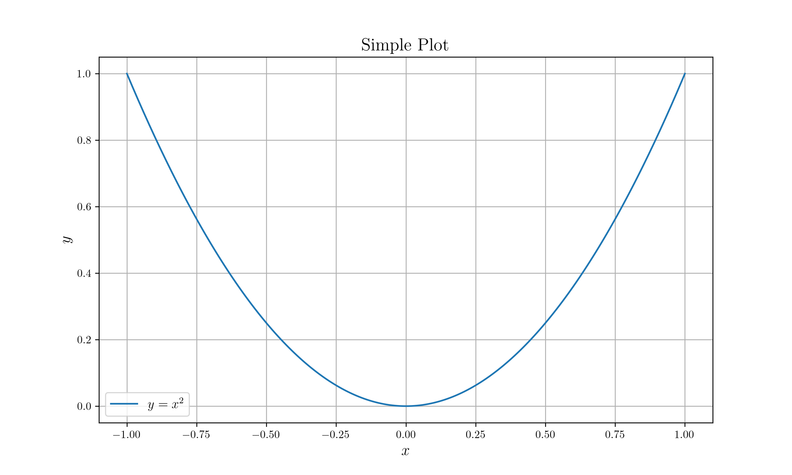

# DataFrame tutorial

## Pre-requisite

* `netcdf` related dependency (`libnetcdf`, `netcdf4` library for python)

## Description

* Generate `x = -1:0.01:1`
* Generate `y = x^2`
* Save `x, y` to `data/data.nc`
* Plot the data

## Build Process

```sh
# Build
cargo build --release

# Run
cargo run --release

# Plot
python nc_plot.py
```

## Result


