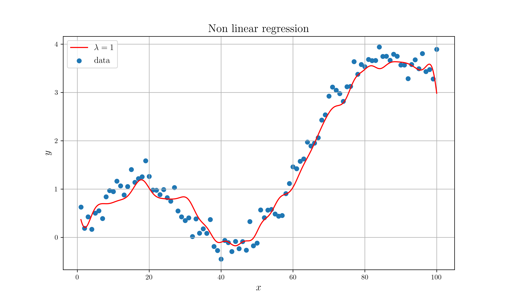
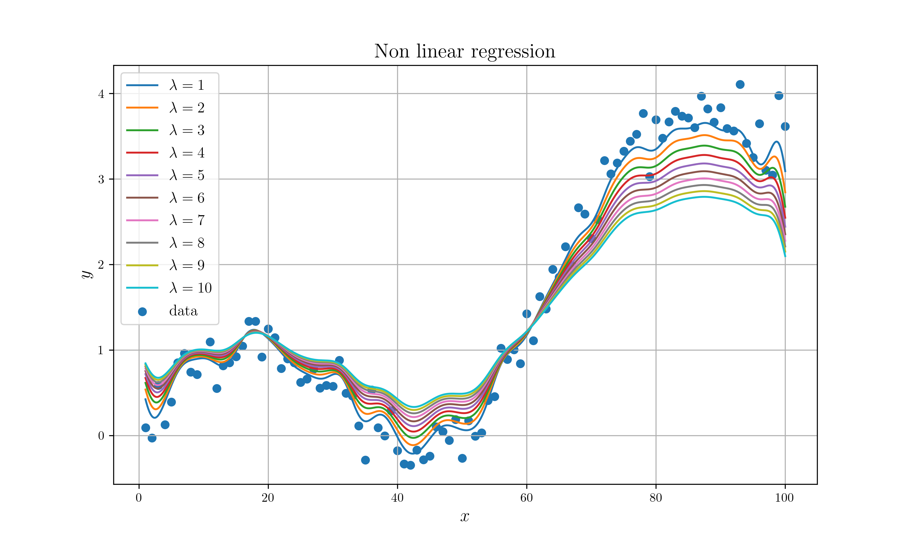

# Linear Regression with Gaussian basis & Ridge regularization

## Description

Linear regression with Gaussian basis & Ridge regularization

## Requirements

* netcdf
* python netcdf4 library
* python matplotlib library (Draw plot)
* texlive or alternatives (Draw plot)

## Build process

```sh
# Build
cargo build --release

# Run Single
cargo run --release --bin single

# Run parallel 10 times
cargo run --release --bin par_10

# Draw Single plot
python nc_plot.py

# Draw Parallel plot
python par_nc_plot.py
```

## Result

### Single Plot



### Parallel Plot


