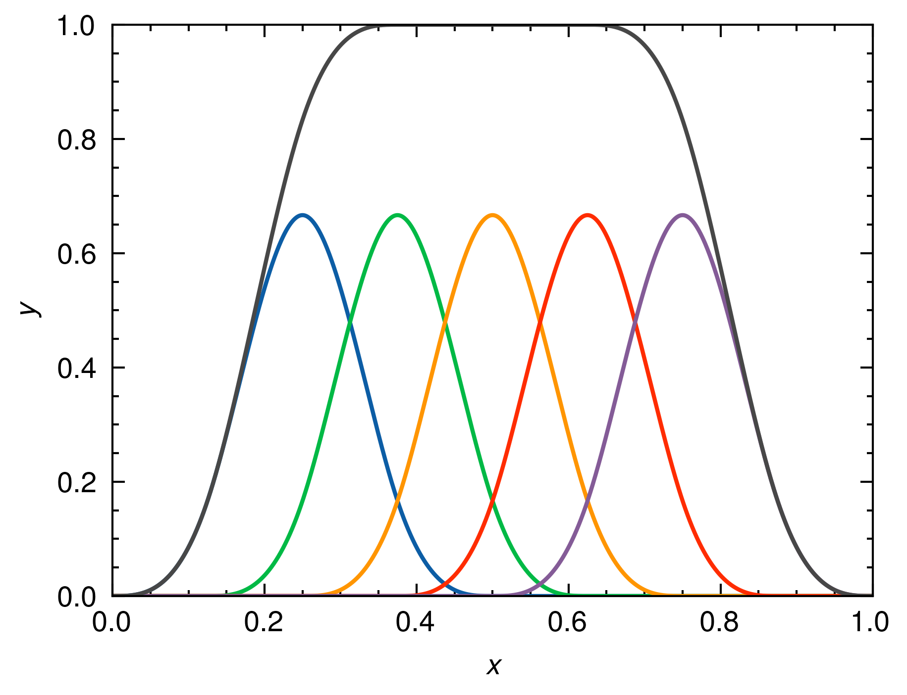

# Uniform Cubic B-Spline Basis Functions

This code demonstrates the implementation and visualization of uniform cubic B-spline basis functions using the Rust programming language and the Peroxide library.

## Description

The code defines two main structures:

1. `CubicBasis`: Represents a unit cubic basis function from the Irwin-Hall distribution (n=4). It is used to evaluate the basis function at a given point within a specified interval.

2. `CubicBSpline`: Represents a set of uniform cubic B-spline basis functions. It is constructed by dividing a given interval into a specified number of basis functions.

The `main` function demonstrates the usage of the `CubicBSpline` structure. It creates a set of cubic B-spline basis functions by dividing the interval (0, 1) into 5 basis functions. It then evaluates the basis functions and the overall spline at 1000 equally spaced points within the interval.

The resulting values are plotted using the Peroxide library, and the plot is saved as an image file named "plot.png".

## Prerequisites

- [Rust](https://www.rust-lang.org/)
- [Python](https://www.python.org/)
- [Matplotlib](https://matplotlib.org/)
- [SciencePlots](https://github.com/garrettj403/SciencePlots)

## Usage

To run the code, ensure that you have Rust and the necessary dependencies installed. The code requires the following dependencies:

- `Peroxide`: Used for plotting and visualization.

You can add the dependencies by running the following command:

```shell
cargo add peroxide --features plot
```

Then, you can run the code using the following command:

```shell
cargo run --release
```

The code will generate a plot of the cubic B-spline basis functions and save it as "plot.png" in the current directory.

## Results



## References

- [Irwin-Hall distribution](https://en.wikipedia.org/wiki/Irwin%E2%80%93Hall_distribution#Special_cases)
- [Peroxide](https://github.com/Axect/Peroxide)
