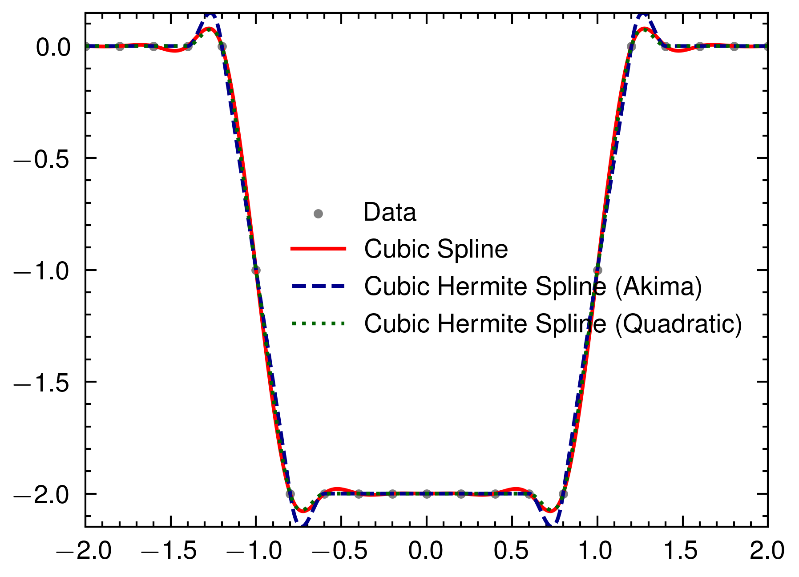

# Cubic Hermite Spline

## Description

* Do Cubic Hermite Spline using following slope selection methods.
    * Akima (1970)
    * Quadratic Interpolation

## Build Process

```sh
# Build
cargo build --release

# Run
cargo run --release --bin cubic_hermite

# Plot
python nc_plot.py
```

## Result



## Reference

* Gary D. Knott, *Interpolating Cubic Splines*, Birkhäuser Boston, MA (2000).
