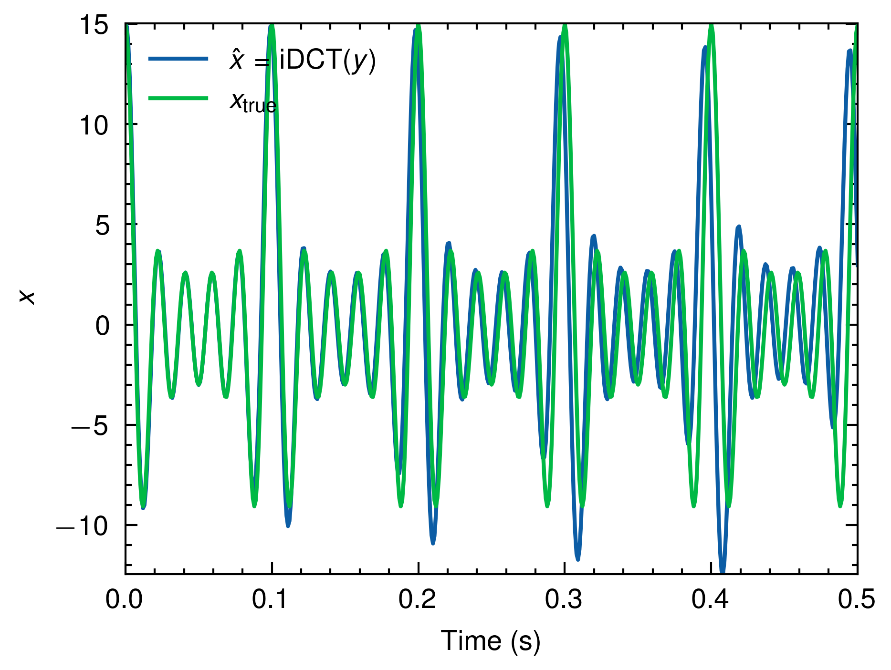

# Discrete Cosine Transform

## Description

Implement Discrete Cosine Transform (DCT) and its inverse via Peroxide and compute the DCT of below function.

$$
f(t) = \sum_{n=1}^{5} n \cos(n \omega t), \quad \omega = 10 \times 2\pi
$$

## Build Process

```sh
# Build & Run
cargo run --release

# Plot
python pq_plot.py
```

## Result

### DCT


### Inverse DCT



