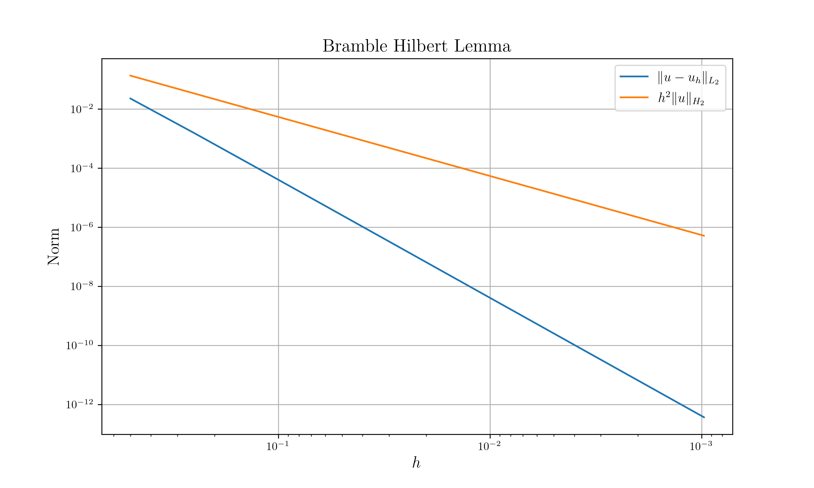
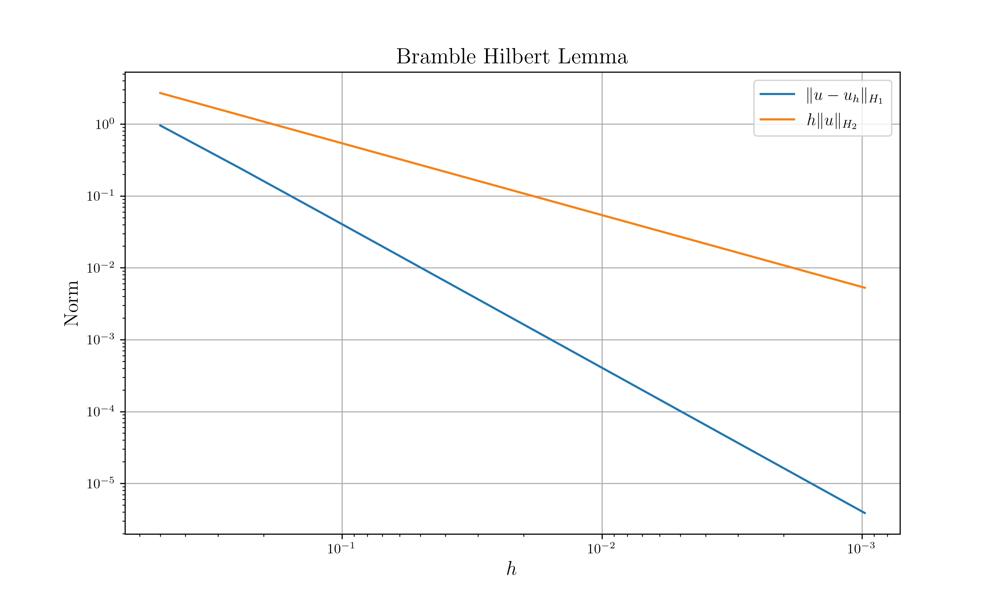

---
fontfamily: "lmodern"
mainfont: "ubuntu"
title: "FEM Homework"
author: [Tae Geun Kim]
date: 2020-05-28
subject: "Markdown"
keywords: [Markdown, Example]
subtitle: "Inverstigate Convergence1"
titlepage: true
toc-own-page: true
header-includes:
    - \usepackage{xcolor}
...

\tableofcontents

\newpage

# Problem

Take $I_h u$ to be interpolant of $u$ so that $I_h u \in P_1$.
Invetigate convergence of $I_h u$ to $u$.

1. $\Vert u - I_h u\Vert_{L^2} \leq c h^2 \Vert u \Vert_{H^2}$

2. $\Vert u - I_h u\Vert_{H^1} \leq c h \Vert u \Vert_{H^2}$

# Process

2D에 대한 구현이 어려워서 1D로 일단 구현해보았습니다. 구현과정은 다음과 같습니다.

1. 주어진 stepsize $h$에 대해 구간 $(0,1)$에서 주어진 함수 $u$를 Piecewise linear하게 interpolation합니다. 따라서 각 구간별로 다항식을 얻습니다.

2. $u$와 $I_h u$의 차이를 측정합니다.
    * $\Vert u - I_h u\Vert_{L^2}$를 측정하기 위해서 Order 15의 Gaussian-Legendre quadrature를 사용했습니다.
    * $\Vert u - I_h u\Vert_{H^1}$을 측정하기 위해서 Gradient는 Dual number structure에 대한 Automatic differentiation을 이용하여 계산하였고 적분은 위와 같이 Order 15의 Gaussian-Legendre quadrature를 사용했습니다.

3. $u$의 norm을 측정합니다.
    * $u$의 $H^2$ norm을 측정하기 위하여 Hessian은 Hyper dual number structure에 대한 Automatic differentiation을 이용하여 계산하였고 Order 15의 Gaussian-Legendre quadrature를 사용헀습니다.

4. $h=2^{-1}$ 부터 $h=2^{-10}$까지 총 10개의 stepsize에 대해서 1 ~ 3 과정을 반복하여 데이터를 얻습니다. $u=\sin \pi x$를 사용하였습니다. 얻은 데이터를 Log scale의 그래프로 그립니다. (스케일의 차이가 꽤 나서 $u$의 $H^2$ norm에는 0.01을 곱하였습니다.)

# Tools

* 모든 계산 코드는 Rust로 작성하였으며 제가 만든 Library인 Peroxide를 이용하였습니다. 모든 함수의 소스 코드는 [github.com/Axect/Peroxide](https://github.com/Axect/Peroxide)에 있습니다.

* 계산을 수행한 뒤 데이터는 netcdf 파일로 저장합니다. 이후 Python으로 해당 데이터를 로드한 뒤, matplotlib을 이용하여 그래프를 그렸습니다.

\newpage

# Results

{ width=80% }

{ width=80% }

\newpage

# Source code

## Github link

소스 코드 링크는 다음과 같습니다.

* 전체 프로젝트 링크: [\textcolor{blue}{Github}](https://github.com/Axect/Peroxide_Gallery/tree/master/Numeric/fem_interp)

* main 함수 코드: [\textcolor{blue}{Github}](https://github.com/Axect/Peroxide_Gallery/blob/master/Numeric/fem_interp/src/main.rs)

* Plot 코드: [\textcolor{blue}{Github}](https://github.com/Axect/Peroxide_Gallery/blob/master/Numeric/fem_interp/nc_plot.py)

원본은 뒷장에 첨부합니다.

\newpage

## main 함수 구현부

\vspace{0.1cm}

```rust
extern crate peroxide;
use peroxide::*;
use std::f64::consts::PI;

fn main() {
    let mut df = DataFrame::with_header(vec!["h", "int_uh", "e_l2", "e_h1", "u_h2", "u_h1"]);
    let mut hs: Vec<f64> = vec![];
    let mut int_uh: Vec<f64> = vec![];
    let mut e_l2: Vec<f64> = vec![];
    let mut e_h1: Vec<f64> = vec![];
    let mut u_h2: Vec<f64> = vec![];
    let mut u_h1: Vec<f64> = vec![];
    for i in 1 .. 11 {
        let h = 1f64 / 2f64.powi(i);
        let ps = piecewise_1d(u, h);
        hs.push(h);
        int_uh.push(poly_int_sum(&ps, h));
        e_l2.push(measure_error(u, &ps, h, Norm::L2));
        u_h2.push(measure_norm(u, Norm::H2) * 0.01 * h.powi(2));
        e_h1.push(measure_error(u, &ps, h, Norm::H1));
        u_h1.push(measure_norm(u, Norm::H2) * 0.1 * h);
    }
    df["h"] = hs;
    df["int_uh"] = int_uh;
    df["e_l2"] = e_l2;
    df["e_h1"] = e_h1;
    df["u_h2"] = u_h2;
    df["u_h1"] = u_h1;

    df.write_nc("data.nc").expect("Can't write nc");

    integrate(|x: f64| u(hyper_dual(x, 0f64, 0f64)).to_f64(), (0f64, 1f64), GaussLegendre(15)).print();
    (2f64 / PI).print();
}

fn u(x: HyperDual) -> HyperDual {
    (x * PI).sin()
}
```

\newpage

## Piecewise 1D interpolation 구현부

\vspace{0.1cm}

```rust
fn piecewise_1d<R1, R2>(u: fn(R1) -> R2, h: f64) -> Vec<Polynomial>
where
    R1: Real,
    R2: Real,
{
    let mut result: Vec<Polynomial> = vec![];
    let x = seq(0, 1, h);
    let y = x.fmap(|t: f64| u(R1::from_f64(t)).to_f64());
    let n = x.len();

    for i in 0..n - 1 {
        let p1 = lagrange_polynomial(vec![x[i], x[i + 1]], vec![y[i], 0f64]);
        let p2 = lagrange_polynomial(vec![x[i], x[i + 1]], vec![0f64, y[i + 1]]);
        result.push(p1 + p2);
    }

    result
}
```

## Norm enum 선언부

\vspace{0.1cm}

```rust
#[derive(Debug, Copy, Clone, Eq, PartialEq)]
pub enum Norm {
    L2,
    H1,
    H2,
}
```

\newpage

## Measure Error 구현부

\vspace{0.1cm}

```rust
fn measure_error<R1, R2>(u: fn(R1) -> R2, ps: &Vec<Polynomial>, h: f64, norm: Norm) -> f64
where
    R1: Real,
    R2: Real,
{
    let mut s = 0f64;
    let mut curr_h = 0f64;
    match norm {
        Norm::L2 => {
            for p in ps {
                let f = |x: f64| (u(R1::from_f64(x)).to_f64() - p.eval(x)).powi(2);
                s += integrate(f, (curr_h, curr_h + h), GaussLegendre(15));
                curr_h += h;
            }
            s
        }
        Norm::H1 => {
            for p in ps {
                let f = |x: f64| (u(R1::from_f64(x)).to_f64() - p.eval(x)).powi(2);
                let df = |x: f64| {
                    let dx = dual(x, 1f64);
                    let du = u(R1::from_dual(dx)).to_dual();
                    (du.slope() - p.diff().eval(x)).powi(2)
                };
                s += integrate(f, (curr_h, curr_h + h), GaussLegendre(15));
                s += integrate(df, (curr_h, curr_h + h), GaussLegendre(15));
                curr_h += h;
            }
            s
        }
        Norm::H2 => unimplemented!(),
    }
}
```

\newpage

## Measure norm 구현부

\vspace{0.1cm}

```rust
fn measure_norm<R1, R2>(u: fn(R1) -> R2, norm: Norm) -> f64
where
    R1: Real,
    R2: Real,
{
    match norm {
        Norm::L2 => {
            let f = |x: f64| u(R1::from_f64(x)).to_f64().powi(2);
            integrate(f, (0f64, 1f64), GaussLegendre(15))
        }
        Norm::H1 => {
            let df = |x: f64| {
                let dx = dual(x, 1f64);
                let du = u(R1::from_dual(dx)).to_dual();
                du.slope().powi(2)
            };
            let l2 = measure_norm(u, Norm::L2);
            l2 + integrate(df, (0f64, 1f64), GaussLegendre(15))
        }
        Norm::H2 => {
            let ddf = |x: f64| {
                let ddx = hyper_dual(x, 1f64, 0f64);
                let ddu = u(R1::from_hyper_dual(ddx)).to_hyper_dual();
                ddu.accel().powi(2)
            };
            let h1 = measure_norm(u, Norm::H1);
            h1 + integrate(ddf, (0f64, 1f64), GaussLegendre(15))
        }
    }
}
```

\newpage

## Plot 구현부

\vspace{0.1cm}

```python
from netCDF4 import Dataset
import matplotlib.pyplot as plt

# Import netCDF file
ncfile = './data.nc'
data = Dataset(ncfile)
var = data.variables

# Use latex
plt.rc('text', usetex=True)
plt.rc('font', family='serif')

# Prepare Plot
plt.figure(figsize=(10,6), dpi=300)
plt.title(r"Bramble Hilbert Lemma", fontsize=16)
plt.xlabel(r'$h$', fontsize=14)
plt.ylabel(r'Norm', fontsize=14)

# Prepare Data to Plot
h = var['h'][:]
e_l2 = var['e_l2'][:]  
e_h1 = var['e_h1'][:]  
u_h2 = var['u_h2'][:]
u_h1 = var['u_h1'][:]

# Plot with Legends
plt.plot(h, e_l2, label=r'$\Vert u - u_h \Vert_{L_2}$')
plt.plot(h, u_h2, label=r'$h^2\Vert u \Vert_{H_2}$')

# Other options
plt.gca().invert_xaxis()
plt.xscale('log')
plt.yscale('log')
plt.legend(fontsize=12)
plt.grid()
plt.savefig("plot/t2m0.png", dpi=300)

# Prepare Plot
plt.figure(figsize=(10,6), dpi=300)
plt.title(r"Bramble Hilbert Lemma", fontsize=16)
plt.xlabel(r'$h$', fontsize=14)
plt.ylabel(r'Norm', fontsize=14)

# Plot with Legends
plt.plot(h, e_h1, label=r'$\Vert u - u_h \Vert_{H_1}$')
plt.plot(h, u_h1, label=r'$h\Vert u \Vert_{H_2}$')

# Other options
plt.gca().invert_xaxis()
plt.xscale('log')
plt.yscale('log')
plt.legend(fontsize=12)
plt.grid()
plt.savefig("plot/t2m1.png", dpi=300)
```