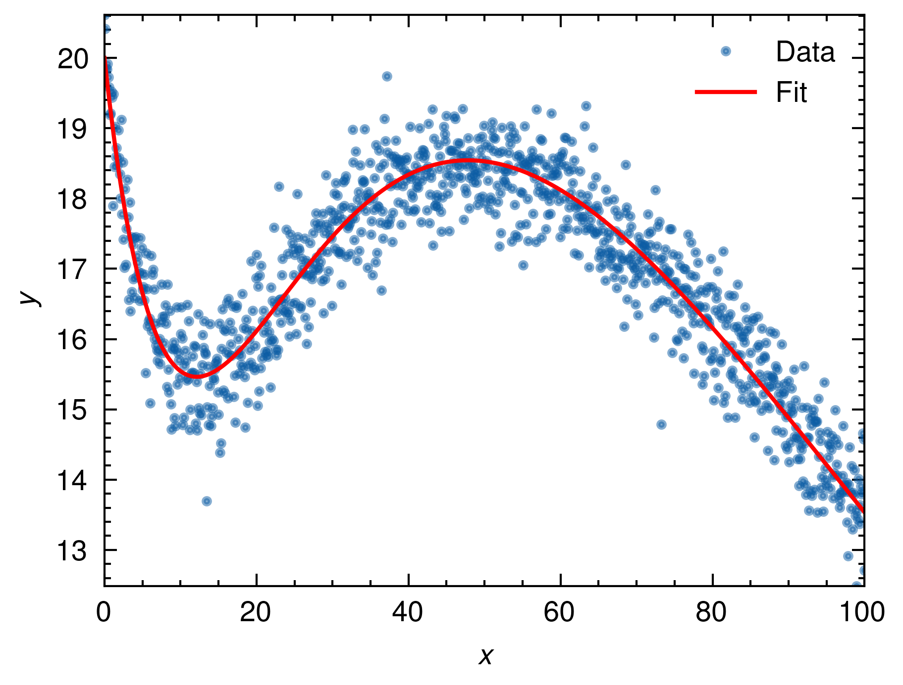

# Lebenverg-Marquardt Algorithm

## Description

See [lm.pdf](http://people.duke.edu/~hpgavin/ce281/lm.pdf)

## Requirements

* Rust
* Python libraries: matplotlib, pandas, pyarrow

## Build Process

1. Run
    ```sh
    # Run
    cargo run --release
    ```

2. Plot
    ```sh
    # Plot
    python pqplot.py
    ```

## Result


