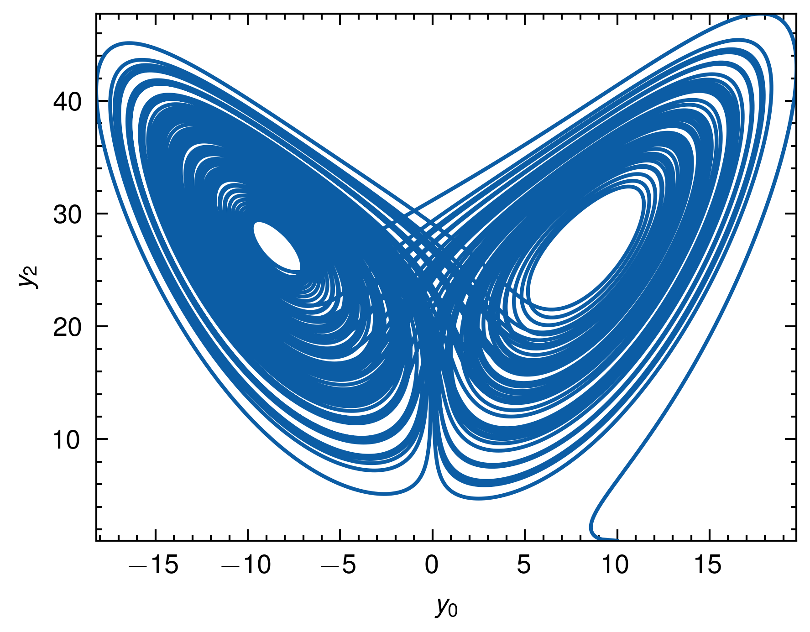

# Lorenz Butterfly

## Description

Implement Lorenz butterfly with Peroxide.
In this project, we use Dormand-Prince 5(4) method to solve the ODE.


## Pre-requisites

- Rust
- matplotlib
- scineceplots

## Build Process

```sh
# Run
cargo run --release
```

## Results


