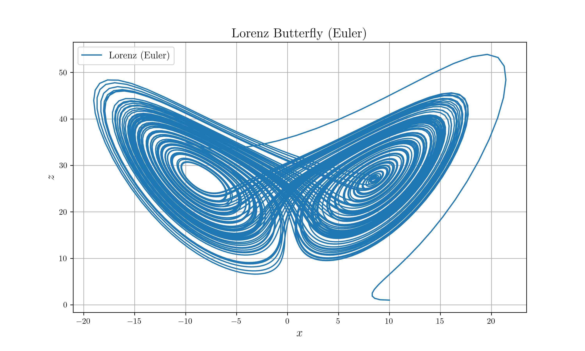
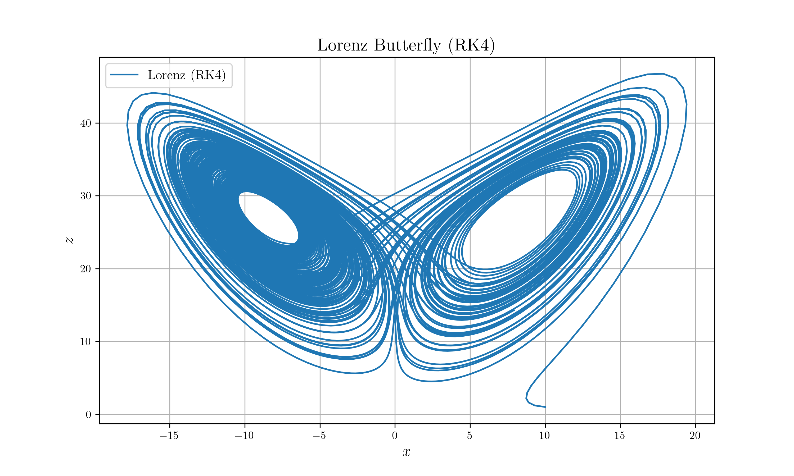

# Lorenz Butterfly

## Description

Implement Lorenz butterfly with several ODE methods.

* Euler
* Runge-Kutta 4th order

## Pre-requisites

* netcdf
    * libnetcdf
    * netcdf4 (python)
* matplotlib

## Build Process

```sh
# Run
cargo run --release

# Plot
python nc_plot.py
```

## Results




