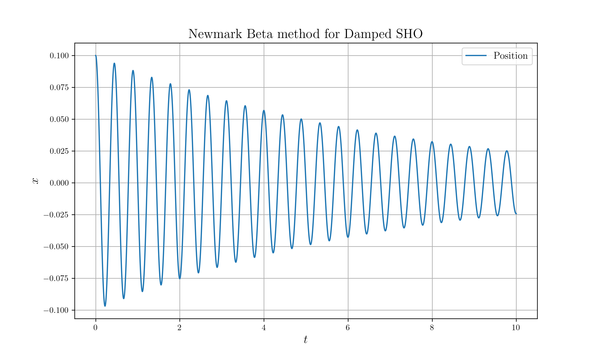
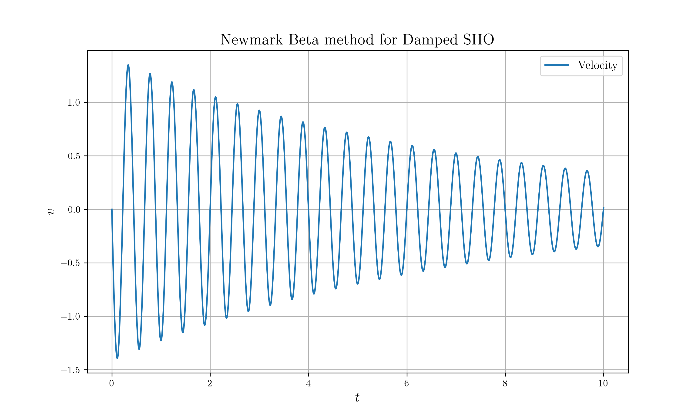
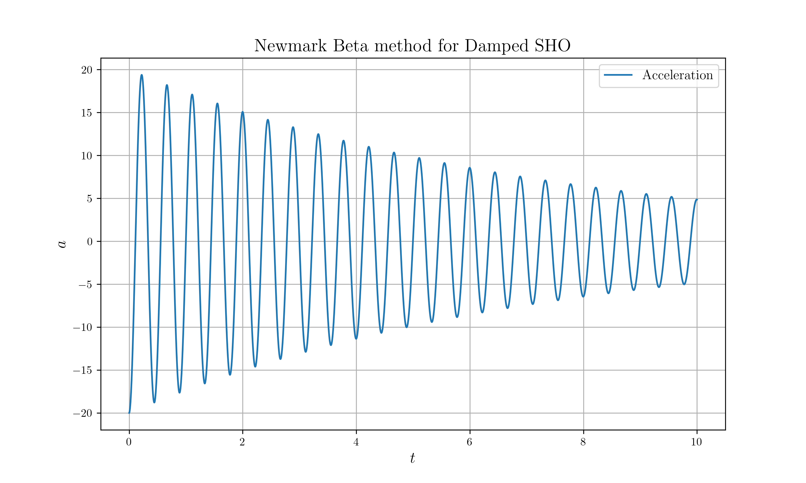
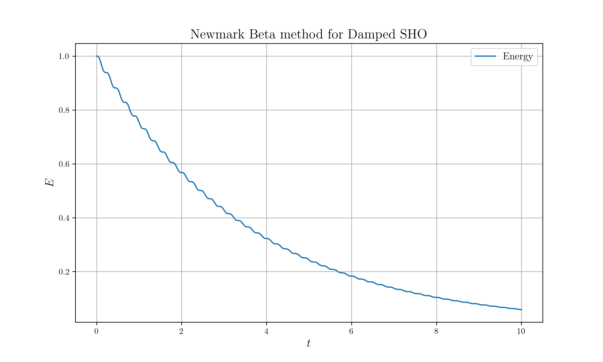

# Velocity-Verlet

## Description

Implement *Newmark Beta* method for damped harmonic oscillation

$$
m\ddot{u} + c\dot{u} + ku = 0
$$

* $m = 1\text{kg}$
* $k = 200 \text{N} / \text{m}^2$
* $c = \zeta \cdot 2\sqrt{km}$
* $\zeta = 0.01$

## Build Process

```sh
# If there is no data directory
mkdir data

# Build & Run
cargo run --release

# Plot
python nc_plot.py
```

## Result








