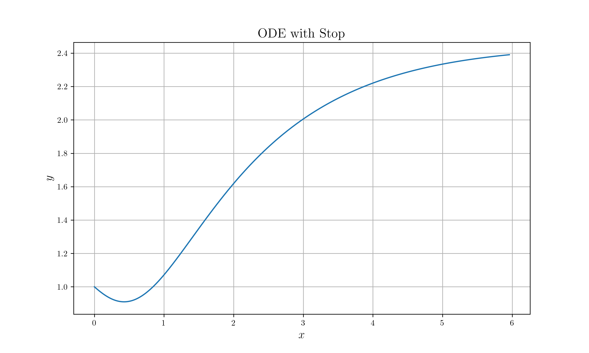

# ODE with stop condition

## Description

Example for using stop condition in `ODE`

## Build Process

```sh
# If there is no data directory
mkdir data

# Build & Run
cargo run --release

# Plot
python nc_plot.py
```

## Result


