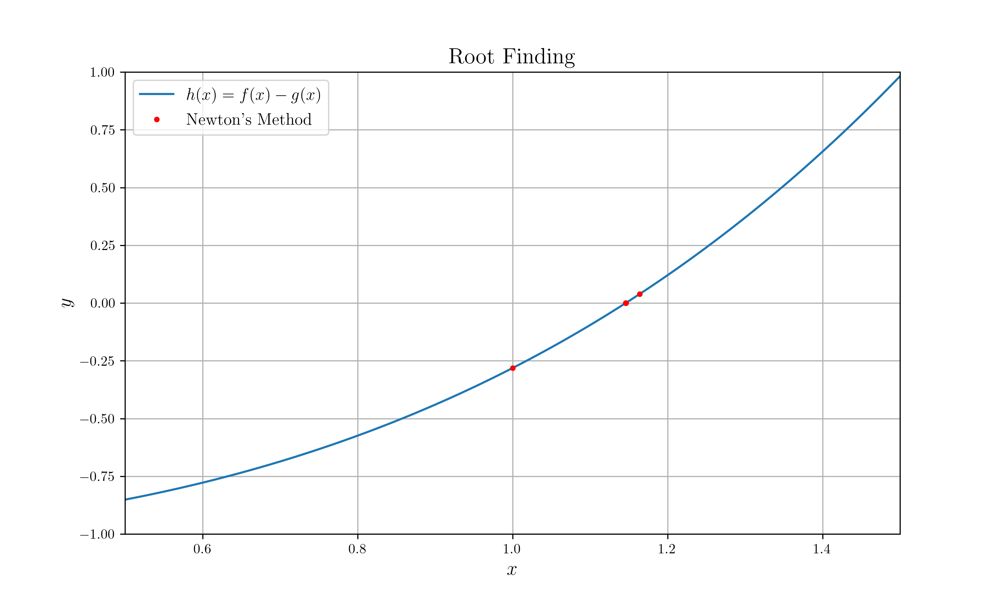

# Root Finding with saving history

## Peroxide Version

`0.30.12`

## Target Function

Find `x` such that `f(x) = g(x)`

* `f(x) = exp(x)`
* `g(x) = x+2`

## Method

Use Newton's method

## Result



## Build Process

```sh
# Make Directory
mkdir data

# Build
cargo build --release

# Run
cargo run --release

# Plot
python plot.png
```
