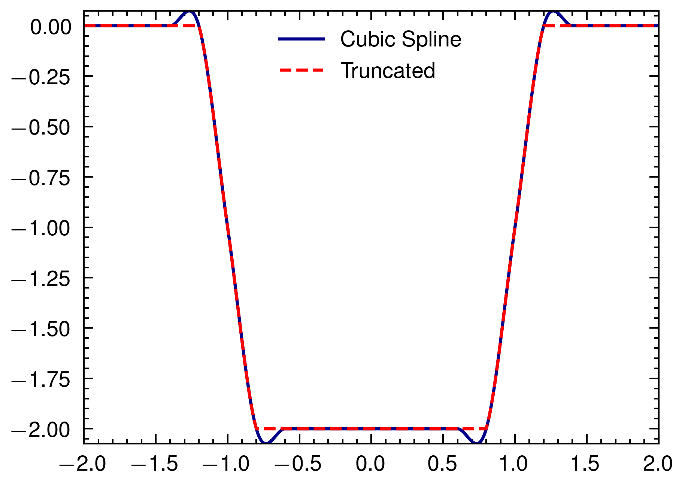

# Truncated Cubic Hermite Spline

## Description

* After peroxide v0.31.6, we can evaluate spline with a condition
* The condition we use here is :

$$ p(x) = \begin{cases}
0 & (x > 0) \\
-2 & (x < -2) \\
x & \text{else}
\end{cases} $$

## Build Process

```sh
# Run
cargo run --release
```

## Result


