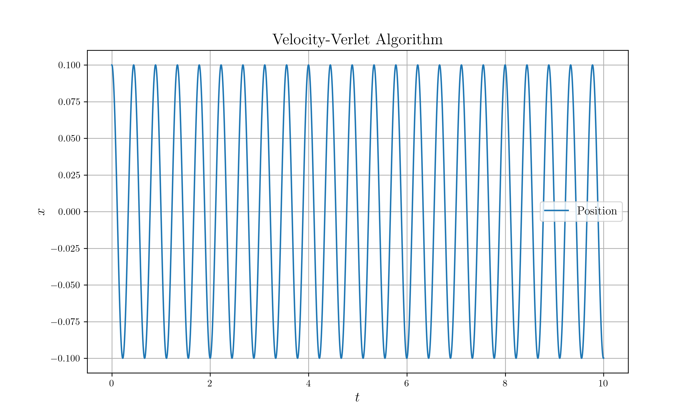
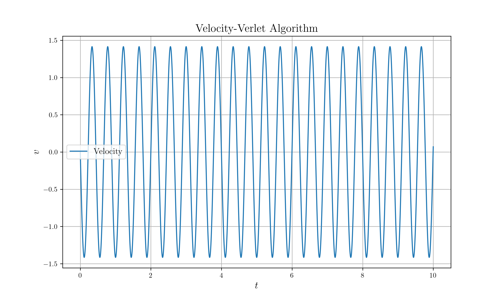
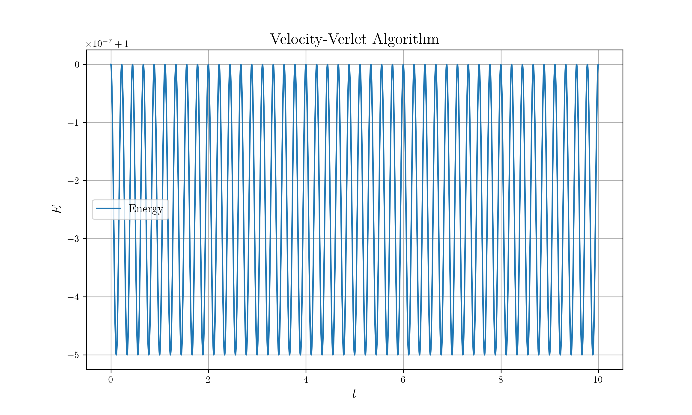

# Velocity-Verlet

## Description

Implement *Velocity Verlet* for simple harmonic oscillation

* $m = 1\text{kg}$
* $k = 200 \text{N} / \text{m}^2$

## Build Process

```sh
# If there is no data directory
mkdir data

# Build & Run
cargo run --release

# Plot
python nc_plot.py
```

## Result






