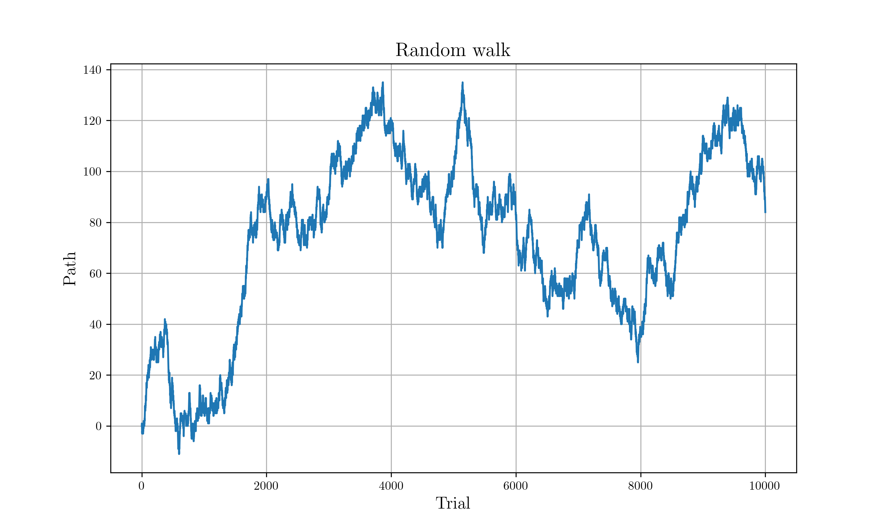

# Brownian Motion (Random walk)

## Description

Statistically independent successive steps with following transition probability.

```rust
#[allow(non_snake_case)]
fn W(i: i64, j: i64) -> f64 {
    if (i - j).abs() == 1 {
        0.5
    } else {
        0.0
    }
}
```

It can be simply implemented via Bernoulli distribution.

## Build process

```sh
# Just run
cargo run --release

# Plot
python nc_plot.py
```

## Result


