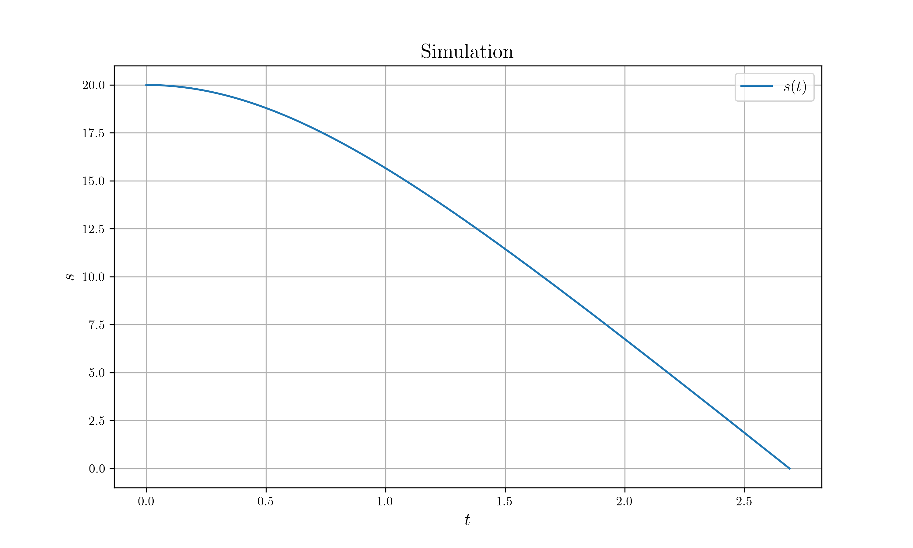

# Falling with Drag force

## Initial Condition

* At top of building with 20m height : $s=20$
* Let go of 1kg ball
* Air resistance drag force : $0.1 v^2$
* Gravitational acceleration : $g=10m/s^2$

## Problem

Find the time of when the ball fell to the ground.

## Prerequisites

* `netcdf4`
* `python-netcdf4`
* `matplotlib`

## Build Process

```sh
# Build
cargo build --release
# Run
cargo run --release
# Plot
python nc_plot.py
```

## Result


