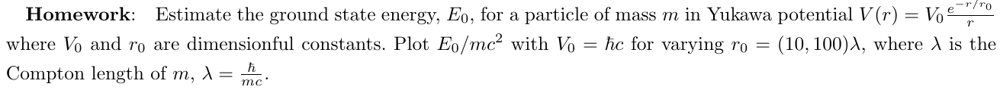
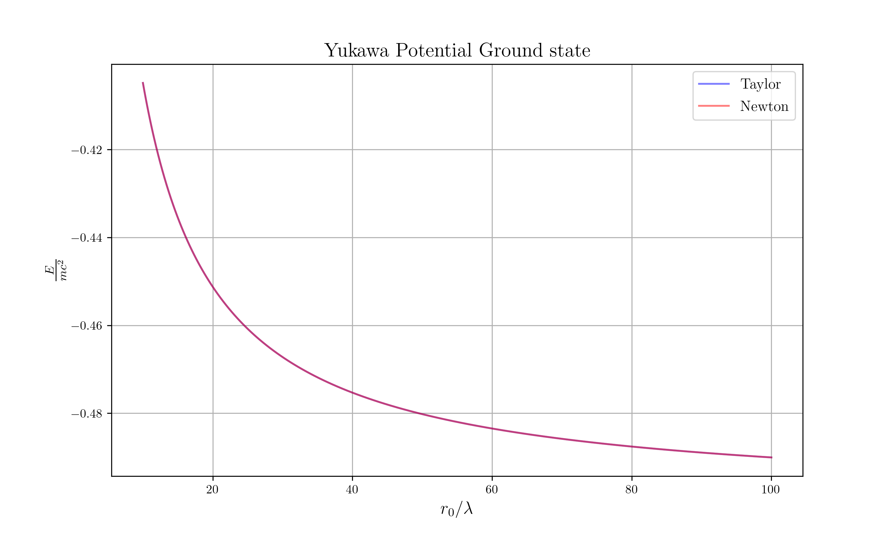

# Estimate Ground state of Yukawa Potential (1D)

## Problem



## Result



## Prerequisites

* `netcdf`
* `python-netcdf4`

## Build Process

```sh
# Build
cargo build --release

# Run
cargo run --release

# Plot
python nc_plot.py
```
