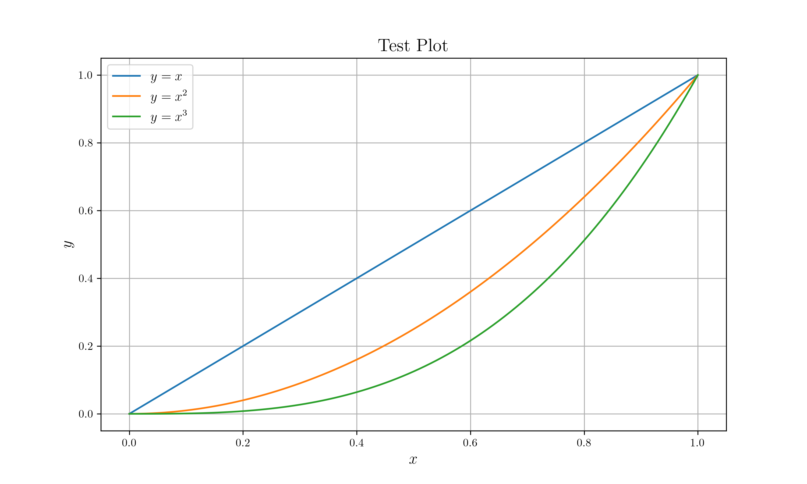

# Peroxide + Matplotlib + Netcdf

## Prerequisites

* Python libraries
    * `matplotlib`
    * `netcdf4`
* System libraries
    * `netcdf`

## Process

Let's draw a multiple line plot - $y=x,~y=x^2,~y=x^3$.

File structure is as follows.

* Project root
    * src
        * `main.rs`
    * data (Empty directory - we will write data into this folder)
    * `Cargo.toml`

1. Main code (`src/main.rs`)
    ```rust
    extern crate peroxide;
    use peroxide::fuga::*;
    use std::error::Error;
    
    // Let's draw a plot y = x, y = x^2, y=x^3
    
    fn main() -> Result<(), Box<dyn Error>> {
        // First make a domain vector (0 to 1 with stepsize 0.01)
        let x = seq(0, 1, 0.01);
        
        // Second make x^2
        let x2 = x.fmap(|t| t.powi(2));
    
        // Third make x^3
        let x3 = x.fmap(|t| t.powi(3));
    
        // Create dataframe
        let mut df = DataFrame::new(vec![]);
        df.push("x", Series::new(x));
        df.push("x2", Series::new(x2));
        df.push("x3", Series::new(x3));
    
        // Write dataframe to netcdf format
        df.write_nc("data/plot.nc")?;
    
        Ok(())
    }
    ```

2. Run Main code
    ```sh
    cargo run --release
    ```

3. Python Code (`nc_plot.py`)
    ```python
    from netCDF4 import Dataset
    import matplotlib.pyplot as plt
    
    # Import netCDF file
    ncfile = 'data/plot.nc'
    data = Dataset(ncfile)
    var = data.variables
    
    # Use latex
    plt.rc('text', usetex=True)
    plt.rc('font', family='serif')
    
    # Prepare Plot
    plt.figure(figsize=(10,6), dpi=300)
    plt.title(r"Test Plot", fontsize=16)
    plt.xlabel(r'$x$', fontsize=14)
    plt.ylabel(r'$y$', fontsize=14)
    
    # Prepare Data to Plot
    x = var['x'][:]
    y1 = var['x'][:]
    y2 = var['x2'][:]
    y3 = var['x3'][:]
    
    # Plot with Legends
    plt.plot(x, y1, label=r'$y=x$')
    plt.plot(x, y2, label=r'$y=x^2$')
    plt.plot(x, y3, label=r'$y=x^3$')
    
    # Other options
    plt.legend(fontsize=12)
    plt.grid()
    plt.savefig("plot.png", dpi=300)
    ```

4. Run python code
    ```sh
    python nc_plot.py
    ```

5. Finish - there is `plot.png` now.


