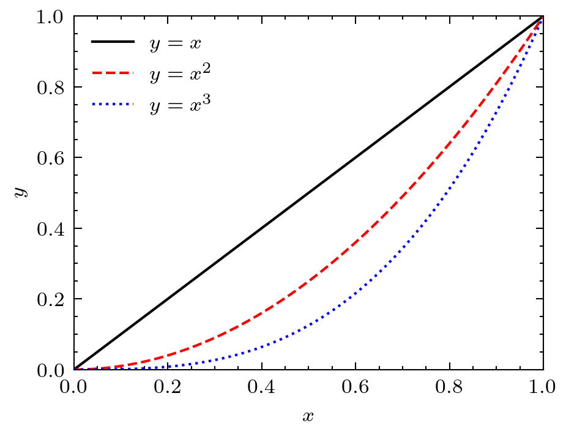

# Peroxide Plot Feature

## Prerequisites

* Python - `matplotlib`, `scienceplots`

## Description

This code generates same plot as [matplotlib with netcdf](https://github.com/Axect/Peroxide_Gallery/tree/master/Plot/matplotlib_with_netcdf).

## Process

Just run!

```sh
cargo run --release
```

## Result

- Default style
  

- Science style (Default style for scienceplots)
  

- Nature style
  

- IEEE style
  
