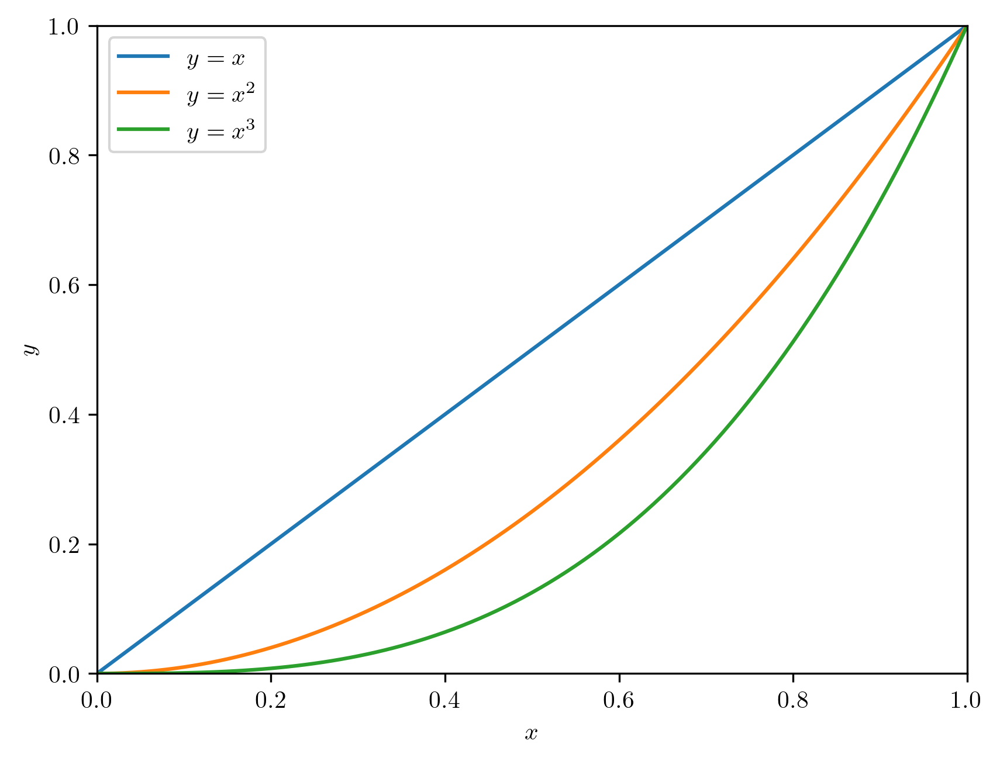
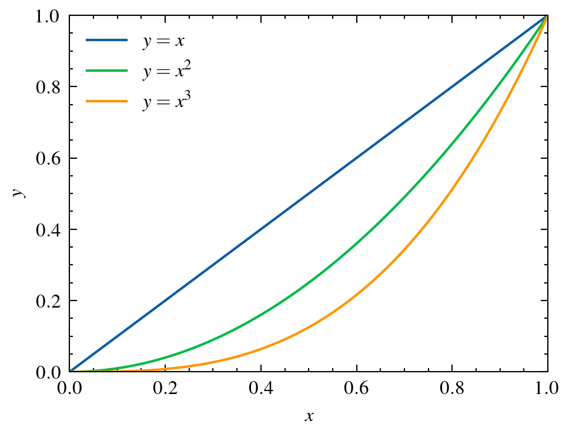
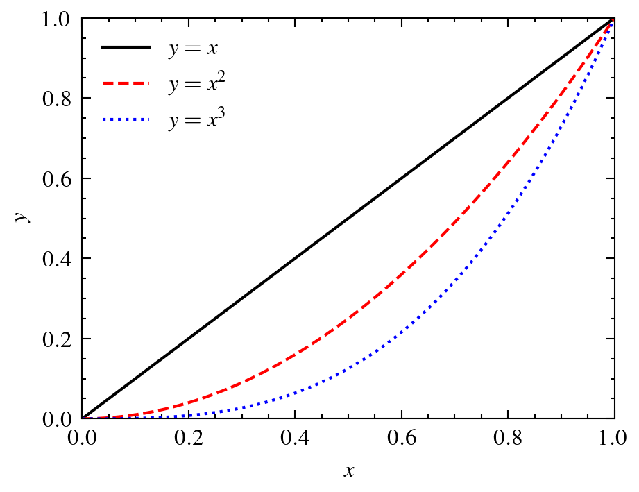

# Peroxide Plot Feature 2

## Prerequisites

* Python - `matplotlib`, `scienceplots`

## Description

This code extends Plot Feature to generate all supported style outputs with a single call.

## Process

Just run!

```sh
cargo run --release
```

## Result

***Due to issues (probably with PlotStyle.style.use) with specific context settings the Nature style generation is currently disabled in `main.rs`.***

- Default style
  

- Science style (Default style for scienceplots)
  

- Nature style
  

- IEEE style
  
