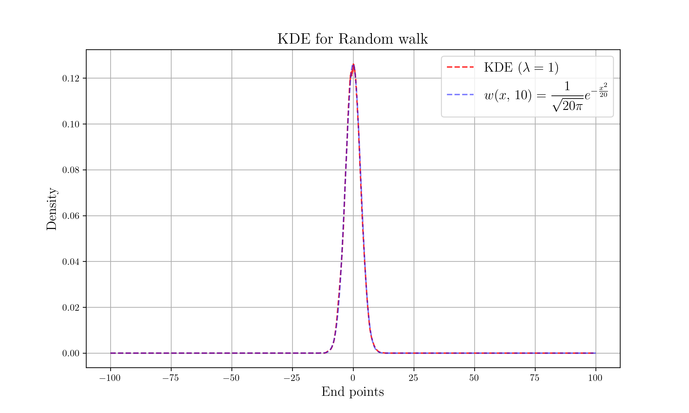

# Solution of Diffusion Equation

## Description

Let consider following one step transition probability :

$$
W(il-jl,\\,\epsilon) = \begin{cases}
\frac{1}{2} & (|i-j| = 1) \\
0 & \text{else}
\end{cases}
$$

For small $\epsilon,\\,l$, the probability distribution function satisfies diffusion equation :

$$
\frac{\partial}{\partial t}w(x,t) = D \frac{\partial^2 w(x,t)}{\partial x^2} ~~\text{ where } D = \frac{l^2}{2\epsilon}
$$

And we can solve above equation with $w_i(0) = \delta_{i0}$ as initial state.

$$
w(x,t) = \frac{1}{\sqrt{4\pi D t}} \exp \left(-\frac{x^2}{4Dt}\right)
$$

In this project, we want to compare distribution of end points of random walks via kernel density estimation (KDE) with this probability distribution function.

## Setting

* Time step : $\epsilon = 10^{-2}$
* Unit Distance : $l = 10^{-1} \\,\Rightarrow\\, t=10,\\,D=\frac{1}{2}$
* Length of Path : $n = 1000$
* Total number of trials : $N = 10000$
* Kernel : Epanechnikov Quadratic Kernel with window size $\lambda = 1$

## Build Process

```sh
# Data Generation
cargo run --release

# Plot
python nc_plot.py
```

## Result



## References

* M. Chaichian, A. Demichev, *Path Integrals in Physics: Volume I Stochastic Processes and Quantum Mechanics*, CRC Press (2001)
