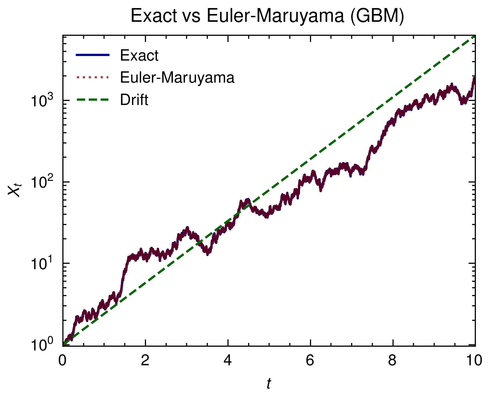

# Geometric Brownian Motion Simulation

This project implements and compares different numerical methods for simulating Geometric Brownian Motion (GBM), a stochastic process commonly used in financial mathematics and quantitative finance.

## Overview

Geometric Brownian Motion is described by the stochastic differential equation (SDE):

$$
dX_t = \mu X_t dt + \sigma X_t dW_t
$$

Where:
- $X_t$ is the process value at time t
- $\mu$ is the drift coefficient (expected return)
- $\sigma$ is the volatility (diffusion coefficient)
- $dW_t$ is the increment of a Wiener process (standard Brownian motion)

The project compares two numerical methods:
1. **Exact solution** - using the analytical formula
2. **Euler-Maruyama method** - a first-order numerical scheme for SDEs

## Implementation

The implementation is written in Rust using the [Peroxide](https://github.com/Axect/Peroxide) library for numerical computations. It includes:

- A `GBM` struct with parameters for the stochastic process
- Methods for generating sample paths using both exact and Euler-Maruyama methods
- Data output to Parquet format for further analysis

## Visualization

Visualization is handled through a Python script (`pq_plot.py`) which:
- Reads the simulation data from the Parquet file
- Creates a plot comparing the exact solution, Euler-Maruyama approximation, and the drift component
- Uses the scienceplots package for publication-quality plots

## Usage

### Running the Simulation

```bash
cargo run --release
```

This generates a `GBM.parquet` file containing the simulation results.

### Plotting the Results

```bash
python pq_plot.py
```

This creates a `plot.png` file visualizing the simulation results.

## Parameters

The current simulation uses the following parameters:
- Initial value (x0): 1.0
- Drift coefficient (μ): 1.0
- Volatility (σ): 0.5
- Time step (dt): 1e-4
- Number of steps: 100,000
- Random seed: 42

## Dependencies

### Rust
- peroxide: For numerical computation and data handling

### Python
- pandas: For data manipulation
- matplotlib: For plotting
- scienceplots: For publication-quality plot styles
- pyarrow: For reading Parquet files

## Results


