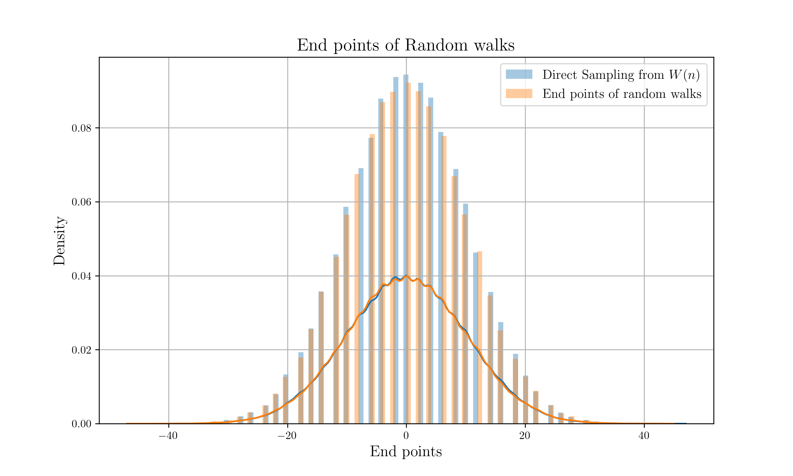

# Sampling from Transition Probability

## Description

Let consider following one step transition probability :

$$
W(il-jl,\\,\epsilon) = \begin{cases}
\frac{1}{2} & (|i-j| = 1) \\
0 & \text{else}
\end{cases}
$$

With assumption of Markov chain, we can get $n$ step transition probability :

$$
W(il-jl,\\,n\epsilon) = \begin{cases}
0 & (|i-j| > n \text{ or } i-j+n \text{ is odd}) \\
\frac{1}{2^n}\begin{pmatrix}
n \\
\frac{i-j+n}{2}
\end{pmatrix} & (|i-j| \leq n \text{ and } i+j-n \text{ is even})
\end{cases}
$$

Then in this project, we compare distribution of direct sampling from this transition probability and distribution of end points of random walks.

## Setting

* Initial point : $j=0$
* Length of path : $n=100$
* Total number of trials : $N = 100000$

## Build Process

```sh
# Data Generation
cargo run --release

# Plot
python nc_hist.py
```

## Result



## References

* M. Chaichian, A. Demichev, *Path Integrals in Physics: Volume I Stochastic Processes and Quantum Mechanics*, CRC Press (2001)
